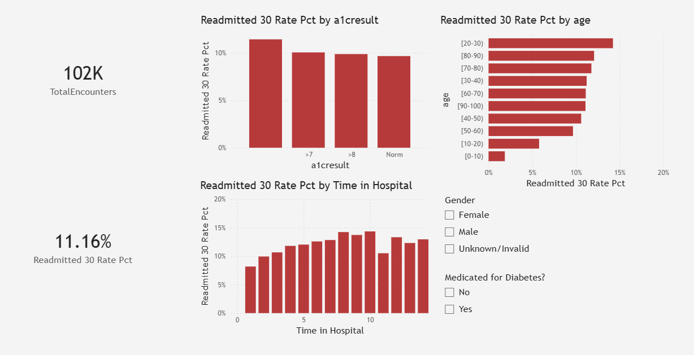

# Diabetes Readmission + HbA1c Quality Dashboard (Python + SQL + Power BI)

## Overview
Hospital readmission is a major clinical quality and cost issue.  
This project analyzes inpatient diabetes encounters and builds a dashboard to track readmission risk patterns and HbA1c-related trends.

## Tools Used
- Python (pandas)
- SQL
- Power BI
- GitHub

## Dataset
Diabetes 130 US Hospitals (1999–2008)  
Includes inpatient diabetes encounters and whether the patient was readmitted within 30 days.

## Questions I Answered
- What percent of patients are readmitted within 30 days?
- How does time in hospital relate to readmission risk?
- Does HbA1c test result correlate with readmission risk?
- Which patient groups show higher readmission rates?

## Project Files (coming soon)
- Python cleaning script
- Cleaned dataset for Power BI
- SQL queries for reporting
- Dashboard screenshots

## Key Results (Summary)
- Readmission risk varies across clinical subgroups, including HbA1c categories and length of stay
- Longer hospital stays generally show higher readmission rates
- Age group breakdown highlights patient segments that may benefit from targeted discharge planning

## Recommendations
- Prioritize follow-up outreach for patients with higher readmission risk signals (e.g., longer length of stay and abnormal HbA1c results)
- Monitor readmission rates by HbA1c category to support diabetes quality improvement initiatives
- Use dashboard filtering (age, gender, diabetes medication) to quickly identify high-risk cohorts for care management workflows

## Dashboard Preview

